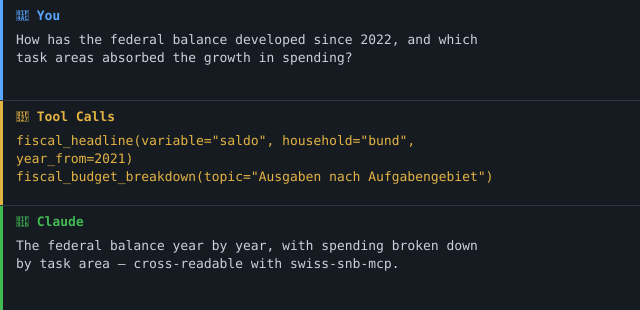

> 🇨🇭 Teil des [**Swiss Public Data MCP Portfolio**](https://github.com/malkreide/swiss-public-data-mcp) — Open-Source-MCP-Server, die KI-Agenten mit Schweizer Behörden- und Open-Data-Quellen verbinden.
> Dies ist ein privates Projekt. Es ist unabhängig von jeder Arbeitgeberin und jeder institutionellen Zugehörigkeit.

# 🏛️ swiss-efv-mcp

[](CHANGELOG.md)
[](https://github.com/malkreide/swiss-efv-mcp/actions/workflows/ci.yml)
[](LICENSE)
[](https://www.python.org/)
[](https://modelcontextprotocol.io/)
[](#architektur-entscheid)
[](https://github.com/malkreide/swiss-public-data-mcp)

> MCP-Server für die Schweizer Bundesfinanzen (EFV): Haushalt, Schulden, Prognosen sowie Ausgaben nach Aufgabengebiet und Institution.

[🇬🇧 English Version](README.md)

## Übersicht

Dieser Server schliesst die Fiskal-Lücke im Economics-&-Finance-Cluster des
Portfolios. `swiss-snb-mcp` deckt die Geldpolitik ab; `swiss-efv-mcp` ergänzt den
**Staatshaushalt** — Einnahmen, Ausgaben, Saldo und Schuldenquoten des Bundes
(inkl. Prognosen bis 2029), einen hierarchischen Haushalts-Drill-down sowie
Ausgaben nach Departement. Datenquelle ist die Eidgenössische Finanzverwaltung
(EFV) via opendata.swiss (OGD Schweiz).

## Funktionen

- Fünf Read-only-Tools über die kuratierten EFV-FS/GFS-Dump-Files.
- Hauptaggregate 1990–2029 nach Haushalt (bund, ktn, gdn, staat, sv) und Modell
  (FS / GFS); jeder Punkt trägt `is_projection`, damit Rechnung und Plan/Prognose
  eindeutig unterscheidbar sind.
- Hierarchischer Bundeshaushalts-Drill-down sowie Ausgaben nach Departement / Einheit.
- 24-h-TTL-In-Memory-Cache mit Stale-Serve-Fallback; Retry mit exponentiellem
  Backoff (2/4/8 s); `dump_status` liefert nie stillschweigend leer.
- Duales Transport: `stdio` (lokal) und SSE (Cloud).
- Keine Authentifizierung nötig — öffentliche Open-Government-Daten (No-Auth-First).

## 🎯 Anchor Demo Query

> *«Wie hat sich der Bundessaldo seit der SNB-Zinswende 2022 entwickelt — und in
> welche Aufgabengebiete floss das Ausgabenwachstum?»*

```
fiscal_headline(variable="saldo", household="bund", year_from=2021)
fiscal_budget_breakdown(topic="Ausgaben nach Aufgabengebiet", level=2)
```

Quergelesen mit `swiss-snb-mcp` verbindet das den Zinszyklus mit dem
Bunddefizit — etwas, das keiner der beiden Server allein beantworten kann.

### Demo



## Voraussetzungen

- Python 3.11+
- [`uv` / `uvx`](https://docs.astral.sh/uv/) (empfohlen) oder `pip`
- Netzwerkzugriff auf `data.finance.admin.ch` und `efv.admin.ch` — kein API-Key nötig

## Installation

```bash
uvx swiss-efv-mcp            # Zero-Install (sobald auf PyPI publiziert)
# oder
pip install swiss-efv-mcp
```

Claude Desktop (`claude_desktop_config.json`):

```json
{
  "mcpServers": {
    "swiss-efv": {
      "command": "uvx",
      "args": ["swiss-efv-mcp"]
    }
  }
}
```

## Quickstart

```bash
# Lokal über stdio (Default-Transport)
uvx swiss-efv-mcp

# Aus einem Checkout, ohne Installation
PYTHONPATH=src python -m swiss_efv_mcp
```

## Konfiguration

Die Konfiguration wird einmalig in ein typisiertes `Settings`-Objekt geladen
(`pydantic-settings`). Die unten genannten Legacy-Namen funktionieren weiter; die
kanonischen Namen nutzen das `EFV_MCP_`-Präfix. Die Defaults sind für den lokalen
Gebrauch sicher.

| Variable    | Default     | Zweck                                                                       |
|-------------|-------------|-----------------------------------------------------------------------------|
| `TRANSPORT` | `stdio`     | Transport: `stdio` (Claude Desktop) oder `sse` / `streamable-http` (Cloud)  |
| `HOST`      | `127.0.0.1` | Bind-Host (nur SSE). Loopback als Default; `0.0.0.0` **nur** im Container setzen |
| `PORT`      | `8000`      | Bind-Port (nur SSE)                                                         |
| `EFV_MCP_LOG_LEVEL`    | `INFO` | structlog-Level (JSON auf stderr)                                 |
| `EFV_MCP_CORS_ORIGINS` | `[]`   | Nur SSE: explizit erlaubte Browser-Origins (Default-Deny; kommasepariert oder JSON) |
| `EFV_MCP_OTEL_ENABLED` | `false`| OpenTelemetry-Tracing aktivieren (benötigt das `otel`-Extra); Export via Standard-`OTEL_*`-Env-Vars |

Cloud (Render / Railway):

```bash
TRANSPORT=sse PORT=8000 swiss-efv-mcp   # exponiert /sse
```

## Verfügbare Tools

| Tool | Zweck |
|---|---|
| `fiscal_headline` | Einnahmen / Ausgaben / Saldo / Schuldenquoten über 1990–2029, nach Haushalt und Modell; jeder Punkt trägt `is_projection` |
| `fiscal_budget_breakdown` | Hierarchischer Bundeshaushalt nach Thema (Ausgaben nach Art / nach Aufgabengebiet, Einnahmen, Bilanz, …) |
| `fiscal_by_institution` | Ausgaben nach Departement / Verwaltungseinheit seit 2007 (Personalausgaben, Informatik, externe Dienstleistungen, Vollzeitstellen) |
| `fiscal_list_dimensions` | Gültige Parameterwerte entdecken — zuerst aufrufen, um korrekte Argumente zu bilden |
| `fiscal_status` | Cache-Aktualität und Upstream-Zustand pro Datensatz; liefert nie stillschweigend leer |
| `dump_status` | **Veralteter** Alias von `fiscal_status` (aus Kompatibilitätsgründen erhalten; wird in einem künftigen Minor entfernt) |

Alle Tools sind **read-only**: jedes ist mit `readOnlyHint: true`,
`destructiveHint: false` annotiert, stellt nur HTTP-GETs an die EFV-Dump-Files
und hat keine Schreib-, Sende- oder Dateisystem-Fähigkeit.

**MCP-Primitives.** Dieser Server nutzt nur das **Tools**-Primitive. Die
EFV-Daten werden live aus gecachten Dumps geschnitten; es gibt keine stabile
Ressourcen-Hierarchie für *Resources* und keine server-eigenen *Prompts*. Die
fünf Tools sind klein und eng verwandt, daher liegen sie in einem einzelnen
`server.py` statt in einem `tools/`-Package.

## Architektur

```
                      ┌──────────────────────────────┐
   Claude / Agent ──▶ │  swiss-efv-mcp (FastMCP)      │
                      │  5 Tools · Pydantic-v2-Env.   │
                      └───────────────┬──────────────┘
                                      │ fetch + retry + TTL-Cache
              ┌───────────────────────┴───────────────────────┐
              ▼                                               ▼
   data.finance.admin.ch                          efv.admin.ch/dam
   fs_dashboard/main_extern.csv                   bundeshaushalt_de.csv
   (Hauptaggregate, 1990–2029)                    institutionen_de.csv
```

## Architektur-Entscheid

Dieser Server nutzt **Architektur C (Dump-first)**.

Begründung (live geprüft am 24.07.2026):
- Das FS/GFS-Dashboard der EFV hat **keine gefilterte Query-API**; es liefert
  statische CSV-Dumps, die das Frontend im Browser filtert.
- Drei kuratierte Files sind klein genug, um sie ganz zu holen und zu cachen
  (516 KB / 5 MB / 1 MB). Sie decken die Hauptaggregate, den hierarchischen
  Haushalt und die Institutionen-Sicht ab — also die beantwortbaren Fragen.
- Die Voll-Cubes (`standardauswertung.csv` 157 MB, `fir_art_funk.csv` 1,23 GB)
  sind für v0.1.0 **out of scope**; ein Laden pro Request ist nicht praktikabel.
  Eine spätere Phase 2 würde sie nach SQLite/Parquet vorverarbeiten.

Konsequenzen:
- Files werden mit 24-h-TTL im Speicher gecacht; ein veralteter Cache wird einer
  leeren Antwort vorgezogen, wenn der Upstream ausfällt.
- Retry mit exponentiellem Backoff für alle HTTP-Aufrufe; `dump_status` liefert
  immer einen auswertbaren Zustand.

## Projektstruktur

```
swiss-efv-mcp/
├── src/swiss_efv_mcp/
│   ├── __init__.py
│   ├── __main__.py        # Entry-Point; duales Transport (stdio / SSE+CORS)
│   ├── client.py          # Dump-first-Datenschicht: Egress-Allowlist, Retry, UA, TTL-Cache
│   ├── logging_config.py  # structlog JSON auf stderr
│   ├── models.py          # Pydantic-v2-Envelopes (source + provenance)
│   ├── server.py          # 5 FastMCP-Tools (annotiert) + testbare *_impl-Funktionen
│   └── settings.py        # typisierte pydantic-settings-Konfig
├── tests/                 # respx-Mock-Tests + Härtungs-Tests + @pytest.mark.live
├── docs/                  # network-egress.md + Accepted-Risk-ADRs
├── audits/                # MCP-Best-Practice-Audit-Runs (Findings, Report, Summary)
├── README.md · README.de.md · CHANGELOG.md · SECURITY.md · CONTRIBUTING.md
├── Dockerfile · server.json · LICENSE
└── pyproject.toml
```

## Sicherheit & Grenzen

- **Read-only.** Jedes Tool ist mit `readOnlyHint: true` annotiert, stellt nur
  HTTP-GETs an die EFV-Dump-Files und hat keine Schreib-, Sende- oder
  Dateisystem-Fähigkeit.
- **Egress-Allowlist.** Ein unveränderliches `ALLOWED_HOSTS`-frozenset +
  `assert_host_allowed()` wird vor jeder Anfrage erzwungen (nur HTTPS, zwei feste
  EFV-Hosts). URLs sind fest kodiert; kein Nutzer-Input baut eine URL. Siehe
  [`docs/network-egress.md`](docs/network-egress.md).
- **TLS aktiv.** Die httpx-Zertifikatsprüfung ist standardmässig aktiv und wird im
  Code nie deaktiviert.
- **Keine Secrets.** Die Endpoints sind öffentliches OGD; es werden keine
  API-Keys oder Secrets gespeichert oder weitergereicht. Ein Browser-`User-Agent`
  wird injiziert, weil die Endpoints den Default-httpx/curl-UA mit `403` abweisen
  (siehe Bekannte Einschränkungen) — nicht entfernen.
- **Fehlermaskierung.** `mask_error_details=True` plus client-seitige Maskierung
  halten rohes Upstream-/Interndetail aus den Tool-Results; das Detail geht nur
  ins structlog-stderr-Log.
- **Input-Bounds.** Tool-Argumente tragen explizite Pydantic-Constraints (Jahr
  `1900–2100`, `level 1–8`, String-`max_length`).
- **Graceful Degradation.** Retry mit exponentiellem Backoff (2/4/8 s); ein
  veralteter Cache wird einer leeren Antwort vorgezogen; `dump_status` liefert
  immer einen auswertbaren Zustand und nie ein stilles Leer.
- **Loopback + Default-Deny-CORS.** SSE bindet an `HOST`, Default `127.0.0.1`;
  `HOST=0.0.0.0` **nur** im Container setzen (das mitgelieferte
  [`Dockerfile`](Dockerfile) tut das). Browser-Origins müssen via
  `EFV_MCP_CORS_ORIGINS` explizit gelistet werden.
- **Auditiert.** Geprüft gegen den Portfolio-MCP-Best-Practice-Katalog
  (44 anwendbare Checks) — siehe [`audits/`](audits/) und [`SECURITY.md`](SECURITY.md).
  Akzeptierte Risiken sind als ADRs unter [`docs/adr/`](docs/adr/) dokumentiert.
- **Nicht amtlich.** Die Zahlen sind nicht amtlich — für den offiziellen Gebrauch
  die EFV-Originale konsultieren.

## Bekannte Einschränkungen

Live-Probe-Befunde (24.07.2026), ebenfalls in `CHANGELOG.md → Known findings`:

| Befund | Auswirkung |
|---|---|
| Endpoints liefern **HTTP 403 ohne Browser-User-Agent** | UA wird vom Client gesetzt; nicht entfernen |
| opendata.swiss-«CSV»-Links zeigen bei 2 Datensätzen auf eine **HTML-Landing-Page** | echte Files via DAM-Pfad (`/dam/de/sd-web/{id}/…`) aufgelöst; die opake ID kann bei Re-Upload rotieren |
| `NA` als Literal-String in `hh`/`model`/`source` | zentral zu `None` bereinigt |
| «Vorausschauend» ist **kein einzelnes Label**: Bund nutzt «Budget/financial plans», `staat` nutzt «Forecasts» | via `is_projection` abstrahiert |
| **Buchhaltungs-Naht 2022/2023** (Themen «bis 2022» vs. «ab 2023») | Zeitreihe hat einen Bruch; ein `note` markiert betroffene Themen |
| Detail-Cubes (157 MB / 1,23 GB) werden nicht ausgeliefert | Phase 2; vorerst die kuratierten Files nutzen |

## Projektphase

Dieser Server ist in **Phase 1 (read-only)**. Jedes Tool holt nur die
öffentlichen EFV-Dump-Files — es gibt keine Schreib-, Sende- oder
Dateisystem-Fähigkeiten.

| Phase | Umfang | Status |
|---|---|---|
| **1 — Read-only** | Hauptaggregate, Haushalts-Breakdown, Ausgaben nach Institution | ✅ aktuell |
| 2 — Detail-Cubes | Die 157-MB-/1,23-GB-Cubes nach SQLite/Parquet vorverarbeiten | geplant |
| 3 — Multi-Agent | (nicht geplant) | — |

Ein Übergang in eine spätere Phase würde vor dem Hinzufügen eines
schreibfähigen Tools ein Re-Audit erfordern.

## MCP-Protokoll-Version

Die Protokoll-Version wird beim `initialize`-Handshake von
[FastMCP](https://pypi.org/project/fastmcp/) ausgehandelt (fixiert `fastmcp>=3.4`
in `pyproject.toml`), das auf dem `mcp`-Python-SDK aufbaut. Die Baseline, gegen
die dieser Server gebaut und auditiert ist, ist **`2025-11-25`**, in `server.py`
als `MCP_PROTOCOL_VERSION` fixiert; ein Regressionstest prüft, dass die
ausgehandelte Version weiterhin damit übereinstimmt — ein protokoll-ändernder
SDK-Bump bricht so die CI **laut** (ARCH-012). Abhängigkeiten werden über
monatliche Dependabot-PRs aktuell gehalten (`.github/dependabot.yml`);
protokoll-relevante Bumps werden in [`CHANGELOG.md`](CHANGELOG.md) vermerkt.

## Testing

```bash
PYTHONPATH=src pytest tests/ -m "not live"   # offline, respx-gemockt
PYTHONPATH=src pytest tests/ -m live         # gegen die echten EFV-Endpoints
PYTHONPATH=src ruff check src tests
```

## Changelog

Siehe [CHANGELOG.md](CHANGELOG.md).

## Mitwirken

Issues und Pull Requests sind willkommen. Bitte Tools read-only halten, vor dem
Einreichen `ruff check` und die Offline-Testsuite laufen lassen und für
nutzersichtbare Änderungen einen Eintrag unter `[Unreleased]` in der
`CHANGELOG.md` ergänzen. Siehe [CONTRIBUTING.md](CONTRIBUTING.md).

Maintainer: siehe [PUBLISHING.md](PUBLISHING.md) für den
Schritt-für-Schritt-PyPI-Release-Prozess (Trusted Publishing via GitHub Release).

## Sicherheit

Siehe [SECURITY.md](SECURITY.md) für Sicherheits-Posture, Härtungskontrollen und
wie Schwachstellen gemeldet werden.

## Lizenz

MIT für diesen Server — siehe [LICENSE](LICENSE). Die EFV-Daten unterliegen
weiterhin den Bedingungen von OGD Schweiz (frei nutzbar, mit Quellenangabe).

## Autor

**Hayal Oezkan** · [github.com/malkreide](https://github.com/malkreide)

## Credits & verwandte Projekte

- Daten: **Eidgenössische Finanzverwaltung EFV** via opendata.swiss (OGD Schweiz, frei nutzbar)
- Companion: [`swiss-snb-mcp`](https://github.com/malkreide) (Geldpolitik) — das Fiskal-/Geld-Paar
- Portfolio-Index: [swiss-public-data-mcp](https://github.com/malkreide/swiss-public-data-mcp)

> Disclaimer: privates Projekt, unabhängig von Arbeitgeber oder Institution. Keine Gewähr; die Zahlen sind nicht amtlich — für den offiziellen Gebrauch die EFV-Originale konsultieren.

<!-- mcp-name: io.github.malkreide/swiss-efv-mcp -->
